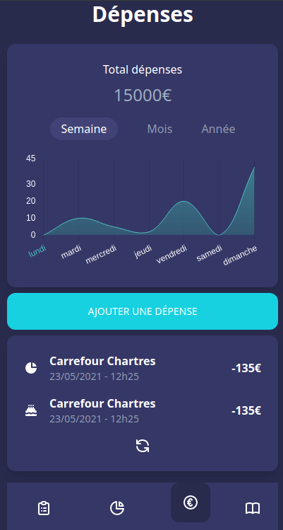

# MoneyRadarApp
Objectif du projet :  Créer une application NodeJS & API REST pour le back et VueJs en front permettant la gestion intélligente de ses dépenses.
 + Organiser et suivre ses propres budgets.
 + Visuliser, structurer & établir des projection sur sont capital/épargne.
 + Gestionnaire de taches jours/semaine/mois
 + Gestionnaire d'objectif associés aux gestionnaire de tache

## Maquette

## Techno utilisées

+ NodeJS (Express, sequelize)
+ VueJs 3
+ Tailwind CSS